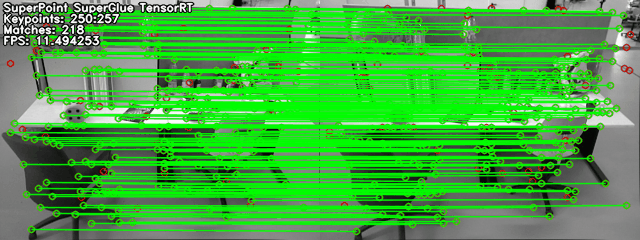

# SuperPoint SuperGlue TensorRT
SuperPoint and SuperGlue with TensorRT. 
Origin repository you can find [here](https://github.com/yuefanhao/SuperPoint-SuperGlue-TensorRT). I added some step for convert model and environment required
## Demo


* This demo was tested on the Quadro P620 GPU.

## Baseline

| Image Size: 320 x 240  | RTX3080 | Quadro P620 | 
|:----------------------:|:-------:|:-----------:|
| SuperPoint (250 points)| 1.04 MS | 13.61 MS    | 
| SuperPoint (257 points)| 1.03 MS | 13.32 MS    | 
| SuperGlue (256 dims)   | 7.47 MS | 58.83 MS    |
| FPS (superpoint one time + superglue one time)   | $\approx$ 117 FPS | $\approx$ 13 FPS    |

## Environment required
cuda==11.6

torch==1.9.1

onnx==1.11.0

onnx-simplifier==0.3.10

onnxoptimizer==0.2.7

onnxruntime==1.11.1

tensorrt==8.4.1.5

## Convert model(Optional)
The converted model is already provided in the [weights](./weights) folder, if you are using the pretrained model officially provided by [SuperPoint and SuperGlue](https://github.com/magicleap/SuperGluePretrainedNetwork), you do not need to go through this step.

(1) torch -> onnx;

(2) onnx -> onnxsim;

(3) int64 -> int32;

```bash
python convert2onnx/convert_superpoint_to_onnx.py --weight_file superpoint_pth_file_path --output_dir superpoint_onnx_file_dir
python convert2onnx/convert_superglue_to_onnx.py --weight_file superglue_pth_file_path --output_dir superglue_onnx_file_dir
```

## Build and run
```bash
git clone https://github.com/lacie-life/SPSG-TRT.git
cd SPSG-TRT
mkdir build
cd build
cmake ..
make
# test on image pairs 100 times, the output image will be saved in the build dir
./superpointglue_image  ../config/config.yaml ../weights/ ${PWD}/../image/image0.png ${PWD}/../image/image1.png
# test on the folder with image sequence, output images will be saved in the param assigned dir
./superpointglue_sequence  ../config/config.yaml ../weights/ ${PWD}/../image/freiburg_sequence/ ${PWD}/../image/freiburg_sequence/match_images/
```
The default image size param is 320x240, if you need to modify the image size in the config file, you should delete the old .engine file in the weights dir.

## Samples
```c++
#include "super_point.h"
#include "super_glue.h"

// read image
cv::Mat image0 = cv::imread("../image/image0.png", cv::IMREAD_GRAYSCALE);
cv::Mat image1 = cv::imread("../image/image1.png", cv::IMREAD_GRAYSCALE);

// read config from file
Configs configs("../config/config.yaml", "../weights/");

// create superpoint detector and superglue matcher
auto superpoint = std::make_shared<SuperPoint>(configs.superpoint_config);
auto superglue = std::make_shared<SuperGlue>(configs.superglue_config);

// build engine
superpoint->build();
superglue->build();

// infer superpoint
Eigen::Matrix<double, 259, Eigen::Dynamic> feature_points0, feature_points1;
superpoint->infer(image0, feature_points0);
superpoint->infer(image1, feature_points1)

// infer superglue
std::vector<cv::DMatch> superglue_matches;
superglue->matching_points(feature_points0, feature_points1, superglue_matches);
 
```

## Acknowledgements
[SuperPoint](https://github.com/magicleap/SuperPointPretrainedNetwork) [SuperGlue](https://github.com/magicleap/SuperGluePretrainedNetwork) [TensorRT](https://github.com/NVIDIA/TensorRT) [AirVO](https://github.com/xukuanHIT/AirVO)
